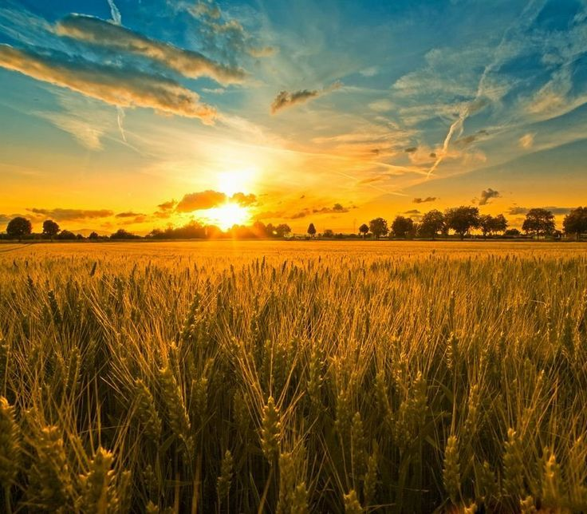
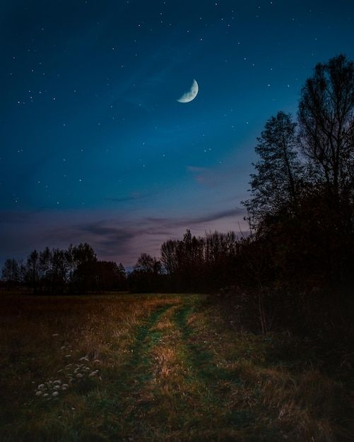

# 🌑Programa altera a foto de acordo com a hora do dia☀

## 🛠️ Tecnologias Utilizadas
- HTML
- CSS
- JS
  
## ⚙ Funcionalidade
O programa vai pegar a **Data 📅** e a **Hora 🕦** do seu computador, a hora é atualizada a cada minuto que passa.

### As mudanças das imagens ficou de acordo com os seguites horários:

**🌅 Manhã (04h - 12h)**

**🌇 Tarde (12h - 17h)**

**🌙Noite (18h - 06h)**

